# C2G-Bench: Hierarchical AI Orchestration for Grid-Interactive Hyperscale Data Centers

**Target Venue:** NeurIPS 2026 — Datasets and Benchmarks Track  
**Strategic Alignment:** HPE Edge-to-Cloud, US DOE Genesis Mission, EU Horizon Europe (Cluster 5)

---

## 1. Executive Summary

This project addresses the **"AI-Energy Paradox"** by transforming 250 MW+ hyperscale data centers from passive power consumers into active, grid-balancing assets. By establishing a formal **Energy System Handshake**, we enable data centers to provide wholesale Frequency Regulation, stabilizing the regional transmission grid in exchange for significant revenue and faster deployment permits.

We solve this using a **Hierarchical AI Orchestration** framework that bridges long-term energy market bidding (minutes/hours) and sub-second hardware physics. The framework evaluates the synergy between three critical control levers: **Throttling Batch Workloads (DVFS)**, **Modulating Cooling Thermal Inertia (CDU pump)**, and **Dispatching Battery Energy Storage (BESS)**. This project delivers a high-fidelity cyber-physical benchmark for NeurIPS 2026, positioning HPE at the frontier of autonomous, grid-interactive infrastructure.

---

## 2. Background: Grid Frequency Regulation and RegD

### What is the RegD signal?

Every power grid must keep its frequency exactly at **60 Hz** (US) or **50 Hz** (EU) at all times. When a generator trips offline or a large load turns on suddenly, frequency deviates. Grid operators use **Automatic Generation Control (AGC)** to recruit *fast-response providers* — assets that can inject or absorb power within seconds to correct the imbalance.

**FERC Order 755 (2011)** created a pay-for-performance market for exactly this. Instead of paying only for *available capacity* (MW committed), it mandates that grid operators also pay for *accuracy* — how precisely an asset tracks the real-time regulation signal. PJM (the largest US grid operator) implemented this as the **RegD** signal: the "D" stands for *dynamic*, meaning it is designed for fast-response resources such as batteries and flexible loads.

### How the RegD signal works

Every **2–5 seconds**, the grid operator broadcasts a normalized score:

```math
\text{RegD}(t) \in [-1,\, +1]
```

The sign convention is:

| Signal value | Grid instruction | Data center must... |
|---|---|---|
| **+1** | Grid has excess load — reduce grid draw | Shed batch load, discharge BESS, or slow cooling |
| **−1** | Grid has excess generation — absorb more | Increase batch load, charge BESS, or raise cooling |
| **0** | Balanced | Hold current power level |

The actual MW response required is:

```math
\Delta P_{\text{demanded}} = C_{\text{MW}} \times \text{RegD}(t)
```

where $C_{\text{MW}}$ (`committed_mw`) is the regulation capacity the data center has pre-contracted to the market for the current 15-minute settlement interval.

### Statistical properties (AR(1) model)

The RegD signal is statistically modelled as a **first-order autoregressive (AR(1)) process** — persistent but zero-mean. At the 5-minute scale it has autocorrelation ρ ≈ 0.80, which time-scales to ρ ≈ 0.997 at the 5-second simulation step used in C2G-Bench. The signal averages to zero over a settlement period, meaning the data center neither gains nor loses net energy from providing regulation.

In `c2g_env/physics/macro_grid.py`:

```python
self._regd_state = rho * self._regd_state + sigma * noise  # AR(1)
regd = np.clip(self._regd_state, -1.0, 1.0)               # normalise to [-1,1]
```

### The performance score (mileage metric)

Under FERC Order 755, the *performance score* is the correlation between the demanded signal and the actual response. A score of 1.0 = perfect tracking; 0.0 = random; below a threshold (typically 0.75) results in zero payment and market suspension. This maps directly to the **β tracking term** in the C2G reward function.

### Why a data center is uniquely suited

A 250 MW hyperscale facility has three fast-response levers unavailable to most grid assets:

1. **Batch compute DVFS** — schedulable HPC/AI training jobs can be throttled in milliseconds via CPU/GPU frequency scaling. Service capacity is capped at `p_flex_max × throttle` (~90 MW); unserved work is **deferred into a FIFO queue** (not dropped) and served when capacity recovers. Average queue delay is tracked via Little's Law and exposed in `obs[16]` (`backlog_norm`).
2. **BESS** — the on-site 150 MWh / 50 MW battery can charge or discharge at full rate in under 100 ms, providing the fastest regulation response.
3. **Thermal inertia (CDU pump)** — the liquid cooling loop acts as a thermal capacitor (τ ≈ 12.7 min). Slowing the pump briefly stores heat in the water loop without immediately raising server temperatures, providing ~5–10 MW of additional regulation headroom for short intervals.

These three levers in combination can follow a RegD signal far more accurately than a single-asset provider, while the hierarchical RL agent learns the optimal trade-off between grid revenue, compute throughput, and thermal safety.

---

## 3. Problem Statement: The "Handshake" Gap

Current data center management systems are "grid-blind": they optimize internal efficiency (PUE) while ignoring the real-time needs of the regional energy system.

- **The Grid Need:** Modern grids require large loads to respond to Frequency Regulation signals (e.g., PJM RegD) every 2–4 seconds to balance renewable energy volatility.
- **The Datacenter Barrier:** Standard AI controllers cannot track these high-speed signals because they do not account for the non-linear physics of liquid cooling, battery degradation, and the bursty nature of GenAI workloads.
- **The Objective:** Create a synergy where the data center matches the grid's power signal perfectly without violating hardware safety limits or AI training SLAs.

---

## 4. State-of-the-Art and Our Contribution

| SOTA | Gap | Our Step Further |
|------|-----|-----------------|
| **Wang et al., 2019** — Proved DCs can follow grid signals using DVFS. | Used "dummy loads" to intentionally waste power to meet the signal. | We use **BESS + thermal storage synergy** — no wasted power. |
| **Fu et al., 2021** — Demonstrated cooling systems have "thermal inertia" for grid services. | Relies on classical MPC, which fails under unpredictable GenAI serving spikes. | We replace MPC with **Hierarchical RL** to handle extreme, non-linear volatility of Alibaba GenAI traces. |
| **Li et al., 2026** — Identifies the need for intelligent VPP aggregation. | Lacks a standardized, high-fidelity physical testbed for datacenters. | We provide the **first 250 MW-scale evaluation testbed** with real data across 6 global energy markets. |

---

## 5. Technical Solution: Hierarchical AI Orchestration

### 5.0. Formal MDP Specification

C2G-Bench defines a **two-level hierarchical Markov Decision Process**. The two agents share no parameters and communicate only through the `inner_action_fn` interface.

#### Lower-Level MDP — C2GFastEnv (5-second ticks)

```math
M_{\text{low}} = (\mathcal{S},\, \mathcal{A},\, P,\, R,\, \gamma,\, T)
```

| Symbol | Definition |
|--------|-----------|
| $\mathcal{S} \subset \mathbb{R}^{17}$ | Normalised observation vector (see §5.2 for index definitions) |
| $\mathcal{A} = [0,1]^3 \times [-1,1]$ | Continuous 4-D action: throttle, pump speed, HVAC effort, BESS dispatch |
| $P(s_{t+1} \mid s_t, a_t)$ | Deterministic physics step + stochastic AR(1) RegD signal (see §2) |
| $R(s_t, a_t)$ | 7-term scalar reward (see §5.3) |
| $\gamma = 0.99$ | Training discount; undiscounted episodic sum used for benchmark ranking |
| $T = 17{,}280$ | Steps per episode (24 h at 5 s per step) |

The only stochasticity in $P$ arises from the AR(1) process driving RegD$(t)$. All physics engines (thermal, BESS, electrical) are **deterministic** given $(s_t, a_t)$. A fixed seed fully determines the trajectory.

**Terminal states:** the episode ends early on three hard constraints — thermal fault ($T > 35\,°\text{C}$), frequency fault ($|\Delta f| > 0.5\,\text{Hz}$), or voltage fault ($v_\text{pcc} < 0.90\,\text{pu}$).

#### Upper-Level Semi-MDP — C2GMacroEnv (15-minute ticks)

The macro agent is framed as a **Semi-MDP** (Sutton et al., 1999) with fixed option duration $K = 180$ sub-steps:

```math
M_{\text{macro}} = (\mathcal{S}_M,\, \mathcal{A}_M,\, P_M,\, R_M,\, \gamma_M,\, T_M)
```

| Symbol | Definition |
|--------|-----------|
| $\mathcal{S}_M \subset \mathbb{R}^{17}$ | Aggregated sub-step states: component-wise means + SOC endpoint + extrema |
| $\mathcal{A}_M = [0,1] \times [-1,1]$ | 2-D: `commit_norm` (regulation MW fraction), `bess_target` (average BESS dispatch) |
| $P_M$ | $K$ applications of the lower-level transition $P$ |
| $R_M$ | $\bar{r}_K + \text{LMP bonus} - \text{churn penalty}$ |
| $\gamma_M = \gamma^K$ | $0.99^{180} \approx 0.163$ effective discount per macro step |
| $T_M = 96$ | Macro steps per episode (24 h $\div$ 15 min) |

where $\bar{r}_K = \frac{1}{K}\sum_{i=0}^{K-1} r_i$ is the mean of the 180 fast-step rewards in macro step $k$.

The macro agent never directly observes the 5-second physics — it sees only the aggregated $\mathcal{S}_M$. This induces **partial observability** at the macro level that the agent must compensate for through robust commitment policies.

### 5.1. Upper-Level Agent: The Market Orchestrator (15-min ticks)

Manages the "Business Handshake." Observes regional market prices, weather forecasts, and the Alibaba batch job queue.

> **Decision:** *"How much flexible MW capacity should I commit to the grid operator for the next 15 minutes?"*

- **Action Space (2-D):** `[commit_norm ∈ [0,1], bess_target ∈ [-1,1]]` — MW commitment and average BESS dispatch.
- **Observation Space (17-D):** Aggregated over 180 sub-steps — mean temps, SOC, tracking error, spike flag, thermal headroom, LMP, previous action, mean frequency deviation, mean PCC voltage, mean backlog norm.
- **Reward:** mean of sub-step rewards + LMP dispatch revenue − commitment-churn penalty.

### 5.2. Lower-Level Agent: The Hardware Controller (5 s ticks)

Executes the physical "Handshake." Receives the real-time frequency regulation signal and uses **four physical levers**:

| Lever | Action dim | Range | Effect |
|-------|-----------|-------|--------|
| **IT (DVFS)** | `action[0]` | [0, 1] | Throttles schedulable Alibaba batch jobs; GenAI/DLRM rigid loads unaffected |
| **Cooling (CDU pump)** | `action[1]` | [0, 1] | Modulates liquid cooling pump speed, exploiting thermal inertia |
| **HVAC** | `action[2]` | [0, 1] | Zone B air-side fan speed |
| **BESS** | `action[3]` | [-1, 1] | Charge (−) / discharge (+) the 150 MWh battery |

- **Action Space (4-D, continuous):** `[throttle_batch, pump_speed_A, hvac_effort, bess_dispatch]`
- **Observation Space (17-D, normalised):**
  | Index | Name | Range | Description |
  |-------|------|-------|-------------|
  | 0 | `temp_A_norm` | [0, 2] | Zone A (liquid-cooled GPU) temperature / T_safe |
  | 1 | `temp_B_norm` | [0, 2] | Zone B (air-cooled CPU) temperature / T_safe |
  | 2 | `bess_soc` | [0, 1] | Battery state of charge |
  | 3 | `p_base_norm` | [0, 1] | Rigid IT load (GenAI + DLRM) |
  | 4 | `p_flex_nom_norm` | [0, 1] | New batch arrivals this tick (trace demand) |
  | 5 | `p_facility_norm` | [0, 2] | Total facility power |
  | 6 | `regd_signal` | [-1, 1] | Grid regulation signal (signed) |
  | 7 | `lmp_norm` | [0, 1] | Locational marginal price |
  | 8 | `grid_load_norm` | [0, 1] | Regional grid load stress indicator |
  | 9 | `is_spike` | {0, 1} | GenAI serving spike flag |
  | 10 | `prev_throttle` | [0, 1] | Previous DVFS throttle |
  | 11 | `prev_pump_speed` | [0, 1] | Previous pump speed |
  | 12 | `pue_norm` | [0, 2] | Current Power Usage Effectiveness |
  | 13 | `T_amb_norm` | [0, 1] | Ambient temperature |
  | 14 | `freq_dev_norm` | [-1, 1] | Normalised grid frequency deviation (swing equation) |
  | 15 | `v_pcc_pu` | [0, 1.1] | PCC voltage in per-unit (Thévenin model) |
  | 16 | `backlog_norm` | [0, 2] | Deferred batch queue depth / p_flex_max (Little's Law queue) |

### 5.3. The NeurIPS Evaluation Metric: The Tracking Reward

The scalar reward received at every 5-second tick has **seven additive terms**:

```math
\begin{aligned}
\mathcal{R} =&\; \alpha \cdot u_{\text{thr}} \\
  &- \beta \cdot \frac{|\Delta P_{\text{demand}} - \Delta P_{\text{actual}}|}{P_{\text{norm}}} \\
  &- \gamma \cdot (T - T_{\text{warn}})^{+} \\
  &- \delta_{\text{soc}} \cdot \mathbf{1}_{\text{soc}} \\
  &- \delta_f \cdot (|\Delta f| - 0.2)^{+} \\
  &- \delta_v \cdot \varepsilon_v \\
  &- \delta_q \cdot \frac{Q_{\text{backlog}}}{P_{\text{flex,max}}}
\end{aligned}
```

where:

- $(x)^{+} = \max(0,\, x)$ — ReLU / hinge: only positive exceedances are penalised
- $u_{\text{thr}} \in [0,1]$ — DVFS throttle fraction; fraction of flexible batch capacity currently committed
- $\Delta P_{\text{demand}} = C_{\text{MW}} \times \text{RegD}(t)$ — MW change requested by the grid operator this tick
- $\Delta P_{\text{actual}} = P_{\text{flex,served}} + P_{\text{BESS,actual}}$ — MW change the DC actually delivered
- $P_{\text{norm}} = C_{\text{MW}} \times 1000$ — normalisation constant (converts tracking error to a [0, ~2] range)
- $T$ — temperature of the hotter of the two cooling zones (°C)
- $T_{\text{warn}} = 33\,°\text{C}$ — soft warning threshold; thermal penalty begins here, 2 °C before the hard trip
- $\mathbf{1}_{\text{soc}}$ — binary flag: 1 if BESS state-of-charge is outside $[10\%, 90\%]$, else 0
- $|\Delta f|$ — absolute grid frequency deviation (Hz) from the 60 Hz nominal
- $\varepsilon_v = (0.95 - v_{\text{pcc}})^{+} + (v_{\text{pcc}} - 1.05)^{+}$ — PCC voltage exceedance (pu) outside the ANSI C84.1 Range A band $[0.95, 1.05]$
- $Q_{\text{backlog}}$ — deferred batch work currently sitting in the FIFO queue (kW-equivalent)
- $P_{\text{flex,max}} \approx 90{,}000\,\text{kW}$ — peak flexible IT capacity at full throttle (1,200 racks × 75 kW)
- Coefficients (all in `config.yaml`): $\alpha{=}1.0$, $\beta{=}2.0$, $\gamma{=}5.0$, $\delta_{\text{soc}}{=}2.0$, $\delta_f{=}2.0$, $\delta_v{=}5.0$, $\delta_q{=}2.0$

#### Term-by-term breakdown

| # | Term | Coefficient | What it measures | Why it matters |
|---|------|-------------|-----------------|----------------|
| 1 | Throughput | $\alpha = 1.0$ | Fraction of max IT capacity actually committed ($u_{\text{thr}} \in [0,1]$) | Maximising revenue — the agent earns more for accepting more DFS workload |
| 2 | RegD tracking | $\beta = 2.0$ | Normalised absolute error between the FERC-requested power change and what the DC actually delivered | The primary ancillary-service obligation — missing this is penalised twice as hard as raw throughput gains |
| 3 | Thermal overrun | $\gamma = 5.0$ | Degrees above the warning threshold $T_{\text{warn}} = 30°$C for the hotter of the two air rows | Linear ramp long before the hard 35 °C trip; $\gamma$ is large enough to dominate at +1 °C overshoot |
| 4 | BESS SoC | $\delta_{\text{soc}} = 2.0$ | Binary flag: 1 if the battery state-of-charge is outside $[10\%, 90\%]$ | Prevents the BESS from being stranded at 0% or 100% when a RegD ramp arrives |
| 5 | Frequency deviation | $\delta_f = 2.0$ | Frequency excursion beyond the ±0.2 Hz NERC dead-band | Proportional penalty that steepens as the grid approaches the ±0.5 Hz trip threshold |
| 6 | Voltage deviation | $\delta_v = 5.0$ | One-sided penalty for PCC voltage outside [0.95, 1.05] pu | Voltage violations are fast and dangerous; the large coefficient forces early corrective action |
| 7 | SLA backlog | $\delta_q = 2.0$ | FIFO queue depth normalised by peak flexible capacity $P_{\text{flex,max}}$ | Deferred batch jobs accumulate in queue; this term penalises latency and incentivises draining the queue |

#### Core tension: why the agent must balance throughput vs. tracking

Terms 1 and 2 are structurally opposed:

- **Higher throttle** ($u_{\text{thr}} \uparrow$) → more revenue from IT (term 1 ↑) but increases the power baseline, making it harder to deliver a downward RegD ramp accurately (term 2 ↓).
- **Lower throttle** ($u_{\text{thr}} \downarrow$) → improves tracking flexibility but sacrifices revenue and grows the backlog (term 7 ↓).

The optimal agent learns a **lever hierarchy**: use BESS charge/discharge first (zero-penalty, fast), then exploit thermal inertia of the cooling system (slow, cheap), and only fall back to DVFS throttling as a last resort. This mirrors real-world FERC-paid frequency regulation.

#### Coefficient scaling rationale

All coefficients are chosen so that terms land in the same numerical range under typical operation:

- $\alpha = 1$ → throughput at $u_{\text{thr}} = 0.8$ contributes $+0.8$ per tick
- $\beta = 2$ → a 40% normalised tracking error contributes $-0.8$ per tick
- $\gamma = 5$ → 1 °C overshoot contributes $-5$ per tick, dominating immediately
- $\delta_v = 5$ → 5% voltage sag contributes $-0.25$ per tick, matching the thermal scale

#### Tracking loop

The RegD tracking error is computed as:

```math
\Delta P_{\text{actual}} = P_{\text{flex,served}} + P_{\text{BESS,actual}}
```

where $P_{\text{flex,served}} = \min\!\left(Q_{\text{backlog}},\ P_{\text{flex,max}} \times u_{\text{thr}}\right)$ is the batch work actually served from the FIFO queue this tick, and $P_{\text{BESS,actual}}$ is the net BESS power after battery dynamics.

#### Cumulative reward scale (per 24-hour episode)

| Agent | Typical range | Notes |
|-------|--------------|-------|
| Random policy | −15,000 to −5,000 | Frequent thermal & voltage trips |
| Rule-based (threshold control) | −2,000 to +500 | No backlog awareness |
| PPO (trained, 5 M steps) | +2,000 to +5,000 | Learns lever hierarchy |
| Adversarial scenario C | −5,000 to −1,000 | High ambient temp + price spike |

**Termination** (episode ends immediately):
- Thermal fault: $T_A > 35°$C or $T_B > 35°$C
- Frequency fault: $|f - f_{\text{nom}}| > 0.5$ Hz (UFLS / over-frequency trip)
- Voltage fault: $v_{\text{pcc}} < 0.90$ pu (under-voltage relay)

Episode truncates at 17,280 ticks (24 hours at 5 s).

### 5.4. Environment Architecture & Data Flow

> 📖 **Full technical reference** — equations, parameters, and API for all 7 physics engines and both environments: [`c2g_env/ENVIRONMENTS.md`](c2g_env/ENVIRONMENTS.md)

The diagrams below describe (0) a high-level system overview, (1) the full hierarchical control loop, (2) the internal step function of `C2GFastEnv`, and (3) the Simplex safety shield that can wrap any agent.

#### Diagram 0 — High-Level System Overview

A one-glance picture of C2G-Bench: an RL agent hierarchy controls a data center *from the inside*, while the power grid drives it *from the outside*.

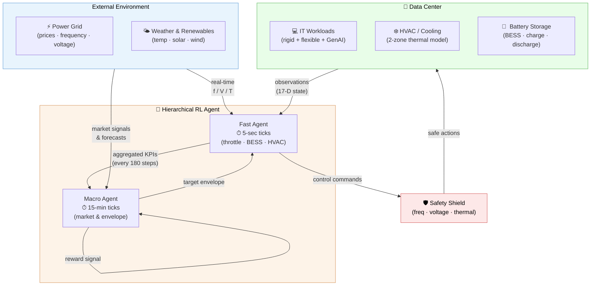

#### Diagram 1 — Hierarchical RL Control Loop

The two agents operate at different timescales and communicate through the `inner_action_fn` interface.  The macro agent sets a 15-minute *target envelope*; the fast agent executes 180 sub-steps inside that envelope before returning aggregated observations to the macro agent.

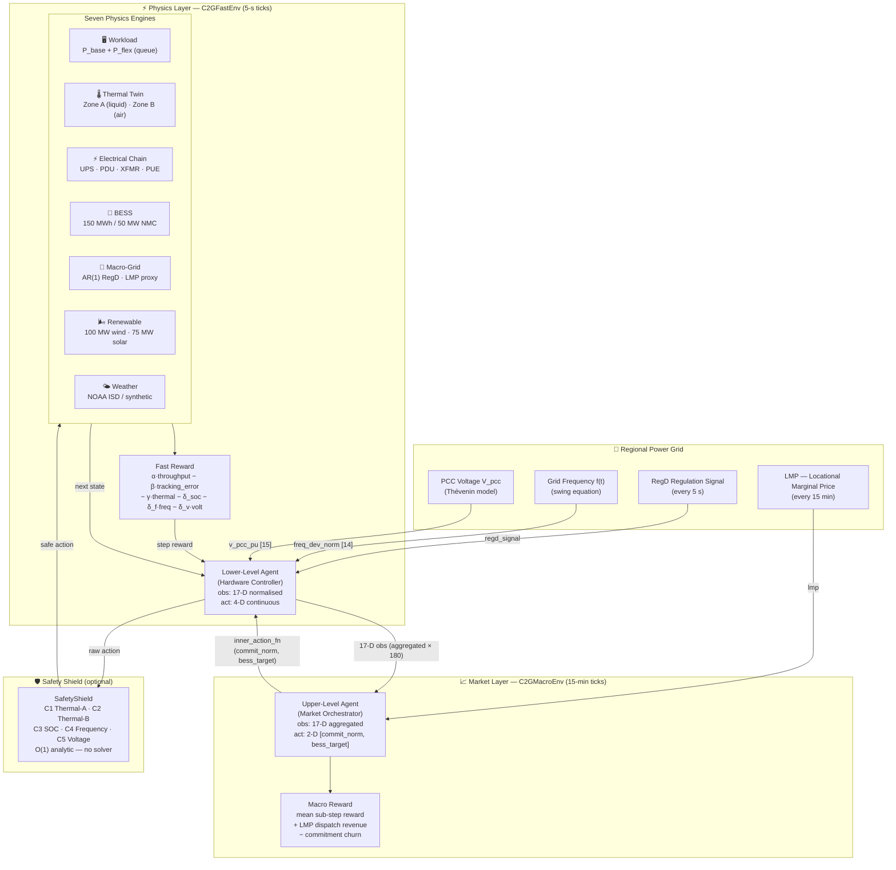

---

#### Diagram 2 — C2GFastEnv Step Function

A single 5-second `env.step(action)` call flows through all seven physics engines in this order:

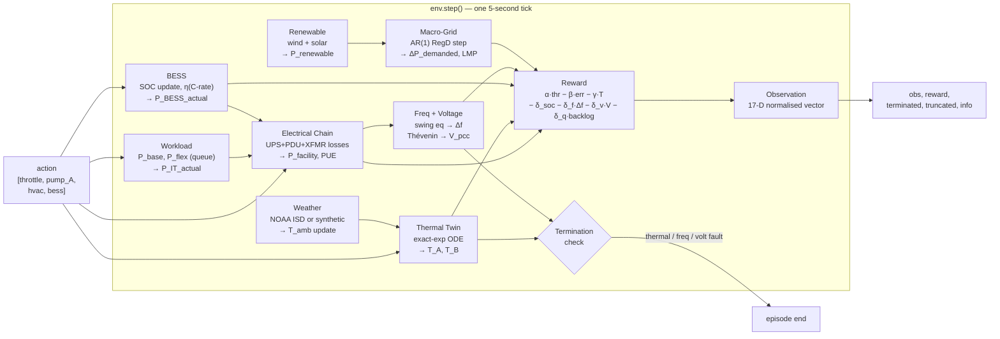

---

#### Diagram 3 — Simplex Safety Shield

The shield sits between any agent and the environment. It intercepts every action, checks five hard constraints analytically, and overrides only the components that would violate a constraint — leaving the rest of the action unchanged.

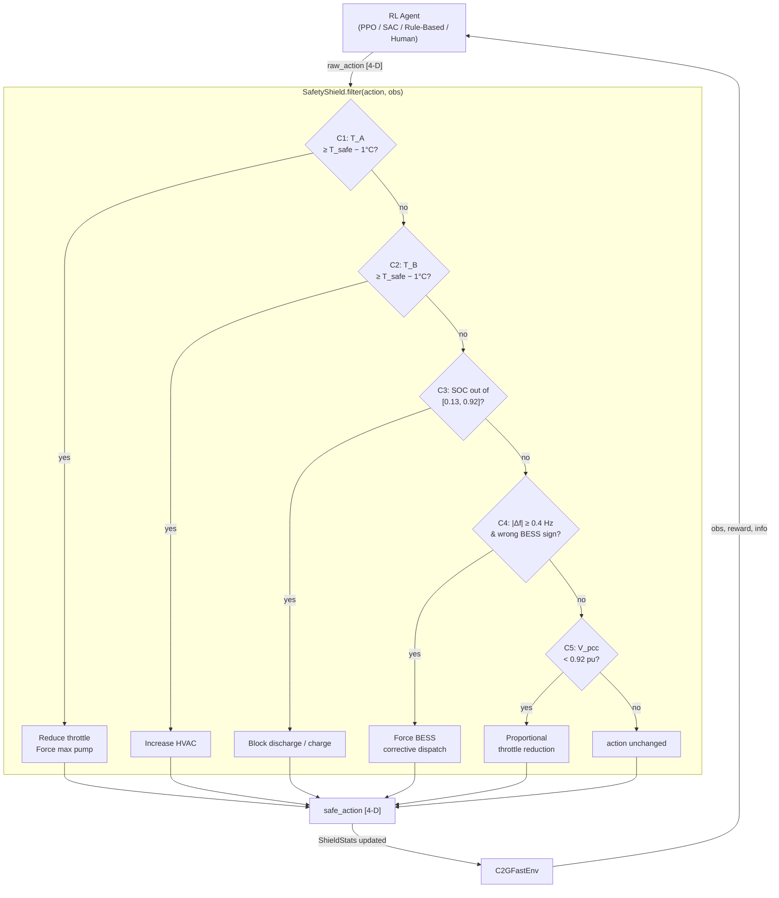

---

#### Diagram 4 — Temporal Hierarchy: 5-second vs 15-minute Timescales

The two environment layers run at different cadences. The fast agent executes **180 × 5-second sub-steps** for every single macro-agent decision. This diagram shows the signal update frequencies, when rewards are computed, and how the macro agent gets its aggregated view.

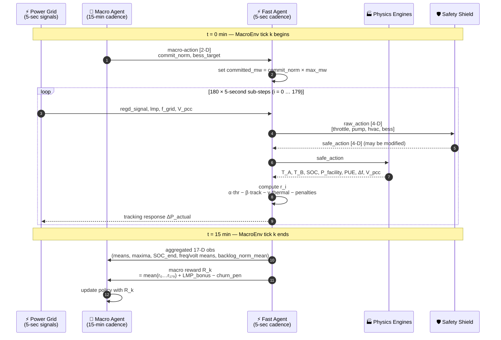

---

#### Diagram 5 — FastEnv 17-D Observation Vector Anatomy

Every five seconds the environment returns a 17-element `float32` vector. This diagram maps each index to its physical meaning and the simulator that produces it.

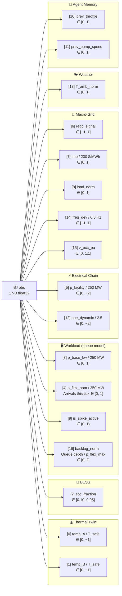

---

#### Diagram 6 — Action Decomposition: 4 Levers → Physical Actuators

Each of the four action dimensions maps to a distinct physical actuator. The signal paths show which physics engines are affected and through what mechanism.

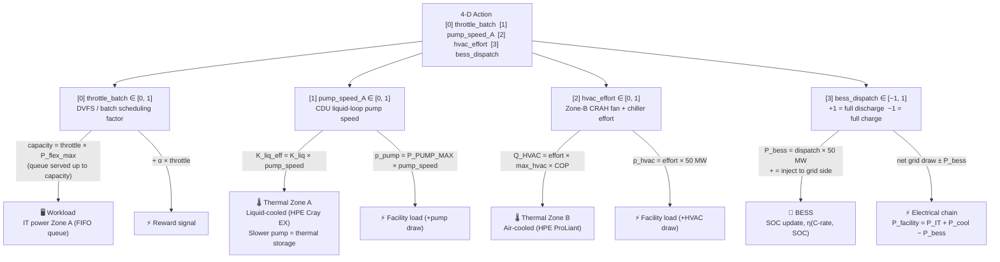

---

#### Diagram 7 — Reward Signal Decomposition

The step reward `r_t` is a weighted sum of a positive throughput term and five normalised penalty terms. Coefficients are set in `conf/` and can be swept independently.

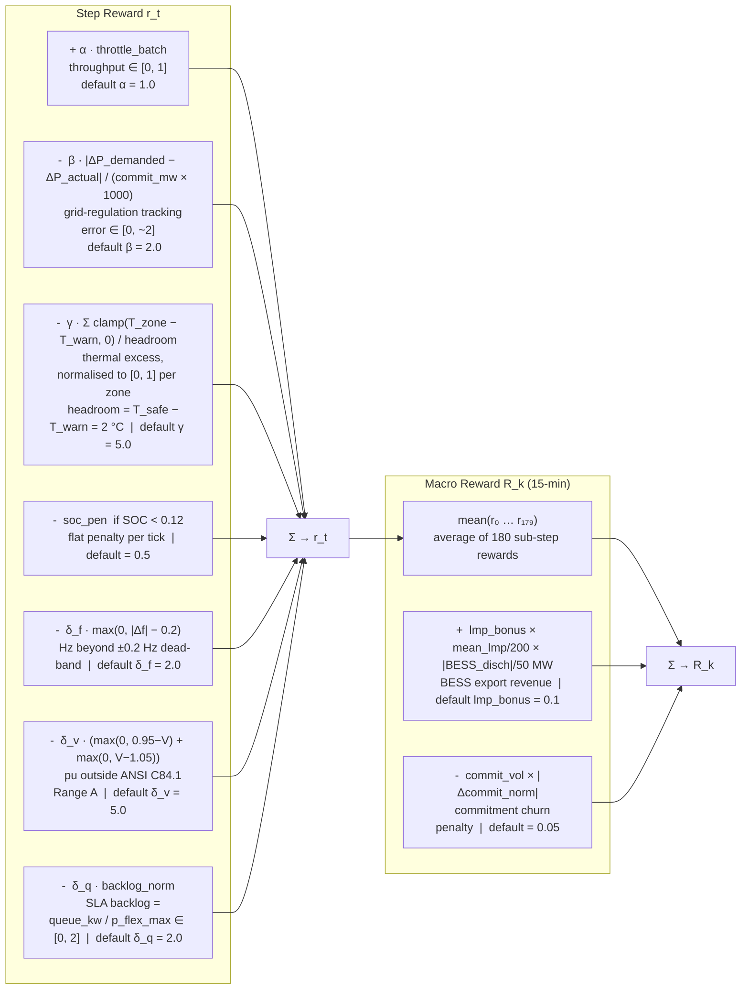

---

#### Diagram 8 — Episode Lifecycle State Machine

A 24-hour episode consists of **17,280 × 5-second ticks** (or 96 × 15-minute macro steps). An episode can end early via three fault conditions or run to completion (truncation).

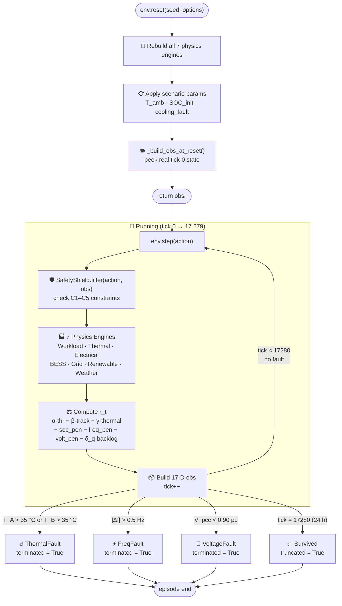

---

---

## 6. Physics Engines

> **C2G-Bench exposes exactly two Gymnasium environments** — `C2GFastEnv` and `C2GMacroEnv` — both registered under `gym.make()`. Everything below is *not* an environment: the seven physics engines are internal simulation components with no `reset()/step()` or `observation_space/action_space` API. They are called exclusively by the two environments and are never exposed to an RL agent directly. If you want to interact with a physics engine in isolation (e.g. for unit testing or analysis), instantiate it directly from `c2g_env.physics.*`.


Seven independent physics/data modules, all with exact-exponential or analytical solutions (unconditionally stable):

| Simulator | File | Description |
|-----------|------|-------------|
| **Workload Orchestrator** | `workload.py` | Fuses Alibaba batch (2023), DLRM (2025), and GenAI (2026) traces into P_base + P_flex at 5-min resolution. FIFO queue model: unserved batch work defers rather than drops; exposes `backlog_kw` and `avg_delay_steps` (Little's Law) per step |
| **Thermal Twin** | `thermal.py` | Exact exponential ODE integration for dual-zone cooling (Zone A: HPE Cray EX liquid, Zone B: HPE ProLiant air) |
| **Electrical Chain** | `electrical.py` | Non-linear UPS/PDU/XFMR loss curves + PUE calculation |
| **BESS** | `bess.py` | 150 MWh / 50 MW Li-ion NMC (pure-Python backend + optional PySAM) with C-rate η, SOC derating, capacity fade |
| **Macro-Grid** | `macro_grid.py` | AR(1) RegD signal + LMP proxy; calibrated for 6 global markets |
| **Renewable** | `renewable.py` | IEC wind power curve (100 MW) + solar PV (75 MW) with degradation |
| **Weather** | `weather.py` | NOAA ISD-Lite real data or calibrated synthetic (6 climate profiles) |

---

## 7. Data

### Real Datasets

| Dataset | Source | Markets/Zones | Resolution | Files |
|---------|--------|--------------|------------|-------|
| **Workload traces** | Alibaba cluster traces | batch, DLRM, GenAI, spot | 5-min | 4 CSVs |
| **Energy load** | EIA, SMARD.de, AEMO | NYISO (11 zones), PJM, CAISO, ERCOT, ENTSO-E DE, AEMO NSW | 5-min (resampled) | 16 CSVs |
| **Weather** | NOAA ISD-Lite | NYC, DCA, SJC, DFW, FRA, BKT | Hourly | 7 CSVs |
| **Renewable** | Synthetic (IEC/PVUSA calibrated) | Wind + Solar | 5-min | 4 CSVs |

### 6 Global Energy Markets

| Market Key | Region | Grid Operator | Energy Source | Weather Station |
|-----------|--------|---------------|---------------|-----------------|
| `nyiso_nyc` | New York City | NYISO | NYISO OASIS | NYC (Central Park) |
| `pjm_dom` | Northern Virginia | PJM | EIA API | DCA (Reagan Natl) |
| `caiso_pgae` | Bay Area / San Jose | CAISO | EIA API | SJC (Mineta Intl) |
| `ercot_north` | Dallas–Fort Worth | ERCOT | EIA API | DFW (DFW Intl) |
| `entso_de` | Frankfurt, Germany | ENTSO-E / EPEX | SMARD.de | FRA (Frankfurt) |
| `aemo_nsw` | Sydney, Australia | AEMO / NEM | AEMO CSVs | BKT (Bankstown) |

---

## 8. Evaluation Scenarios

C2G-Bench ships four progressively harder 24-hour scenarios (17,280 ticks at 5 s each). Every scenario is fully deterministic when a fixed seed is set and can be combined with any of the six energy markets via a single Hydra override.

```bash
# Run any scenario × any market
uv run python baselines/train_ppo.py scenario=scenario_b market=ercot_north
```

### 8.1. Scene-setting: shared physics

All scenarios share the same underlying simulator stack and reward weights:

| Parameter | Value | Meaning |
|-----------|-------|---------|
| Episode length | 17,280 ticks | 24 h × 3,600 s h⁻¹ ÷ 5 s tick⁻¹ |
| IT capacity | 250 MW | Rigid (GenAI/DLRM) + flexible (Alibaba batch) |
| BESS | 150 MWh / 50 MW | NMC Li-ion, C-rate derating + capacity fade |
| Cooling zones | Zone A (liquid, HPE Cray EX) · Zone B (air, HPE ProLiant) | |
| $T_{\text{safe}}$ | 35 °C | Silicon hard limit → immediate termination |
| $T_{\text{warn}}$ | 33 °C | Soft threshold → thermal penalty begins |
| Frequency UFLS | ±0.5 Hz | Under/over-frequency relay → termination |
| Voltage UV relay | 0.90 pu | Under-voltage → termination |

---

### 8.2. `default` — Baseline Operations

> *"Can the agent learn to coordinate four physical levers under normal grid conditions?"*

The entry-level scenario. Ambient temperature is comfortable (25 °C, NYISO NYC summer), BESS starts at 50 % SOC, and the regulation signal has standard amplitude. No faults are injected. This is the recommended starting point for algorithm development and ablation studies.

| Parameter | Value |
|-----------|-------|
| Market | NYISO NYC |
| Ambient $T_{\text{amb}}$ | 25 °C (weather-driven) |
| Committed MW | 15 MW |
| BESS SOC₀ | 50 % |
| GenAI spike scale | 1.0× (nominal) |
| Grid stress scale | 1.0× (nominal) |
| Cooling fault | None |

**Primary challenge:** Learning the basic DVFS ↔ cooling ↔ BESS synergy to track the regulation signal while keeping temperatures below $T_{\text{warn}}$.

**Termination risk:** Low. An untrained random agent survives ≈ 40 % of the episode on average.

---

### 8.3. `scenario_a` — GenAI Crisis

> *"A viral model launch + a grid under-frequency event hit simultaneously. The agent must shed flexible load without starving the BESS."*

This scenario models a **Northern Virginia (PJM DOM)** summer day when a new GPT-class model goes viral. GenAI serving load spikes to **1.8× nominal**, consuming headroom that the agent would otherwise use for regulation. At the same time, the grid issues a sustained under-frequency signal, demanding active discharge. The agent must resolve the conflict between IT throughput and grid support.

| Parameter | Value |
|-----------|-------|
| Market | PJM DOM |
| Ambient $T_{\text{amb}}$ | 30 °C (static) |
| Committed MW | 20 MW |
| BESS SOC₀ | 55 % |
| GenAI spike scale | **1.8×** |
| Grid stress scale | **1.5×** |
| Cooling fault | None |

**Primary challenge:** IT vs. grid conflict. The GenAI rigid load is non-throttleable, so the agent must use BESS discharge and batch-job throttling simultaneously — but throttling reduces throughput reward $\alpha \cdot u_{\text{thr}}$, and over-discharging depletes the BESS.

**Termination risk:** Medium–High. Frequency faults are likely if the agent ignores the regulation signal. Thermal faults are possible if cooling is under-prioritised during spikes.

---

### 8.4. `scenario_b` — Thermal Squeeze

> *"Dallas in August: 40 °C ambient, a 30 MW commitment, and a cooling system pushed to its physical limits."*

This scenario targets **ERCOT North (DFW)** during a peak-summer heat wave. The 40 °C ambient temperature drives the cooling COP down by ≈ 30 %, meaning the pump must work harder to achieve the same heat rejection. The committed MW is raised to 30 MW, increasing the power swings the agent must track. GenAI load is nominal, but the thermal margin to $T_{\text{safe}}$ is extremely thin.

| Parameter | Value |
|-----------|-------|
| Market | ERCOT North |
| Ambient $T_{\text{amb}}$ | **40 °C** (static) |
| Committed MW | **30 MW** |
| BESS SOC₀ | 60 % |
| GenAI spike scale | 1.0× (nominal) |
| Grid stress scale | 1.3× |
| Cooling fault | None |

**Primary challenge:** Thermal constraint binding. The thermal penalty $\gamma \cdot (T - T_{\text{warn}})^{+}$ dominates the reward signal. The agent must learn aggressive pump-speed scheduling and accept reduced throughput to keep temperatures in the safe band.

**Termination risk:** Very High. A naive agent that ignores the pump lever will hit $T_{\text{safe}} = 35$ °C within the first hour. This scenario is the primary driver of thermal-safety research.

---

### 8.5. `scenario_c` — Battery Drain

> *"Western Sydney summer: the BESS starts nearly empty, the pump is failing, and the grid is stressed."*

This scenario represents a compounding failure in **AEMO NSW**. The BESS begins at only **15 % SOC** (near the 10 % hard floor), leaving almost no discharge capacity for regulation. A simulated CDU pump degradation reduces cooling efficiency to **60 % of nominal**, tightening the thermal margin. GenAI and grid stress are both elevated. The agent must simultaneously ration the BESS, compensate for degraded cooling, and track the regulation signal — with essentially no buffer.

| Parameter | Value |
|-----------|-------|
| Market | AEMO NSW |
| Ambient $T_{\text{amb}}$ | 32 °C (static) |
| Committed MW | 20 MW |
| BESS SOC₀ | **15 %** |
| GenAI spike scale | 1.2× |
| Grid stress scale | 1.2× |
| Cooling fault | **Pump degradation (60 % efficiency)** |

**Primary challenge:** Resource scarcity under compound failure. The BESS SOC penalty $\delta_{\text{soc}}$ activates immediately. The agent must switch to DVFS-only regulation while the pump fault is active, and carefully trickle-charge the BESS when the regulation signal allows.

**Termination risk:** Extreme. This is the hardest scenario in the benchmark. A random agent terminates within ≈ 5 % of the episode on average.

---

### 8.6. Scenario × Market grid

All four scenarios can be combined with all six markets, yielding **24 distinct evaluation configurations**. Market selection changes the LMP profile, weather driver, and grid-stress statistics, while scenario selection changes the hardware stress and initial conditions:

| | `nyiso_nyc` | `pjm_dom` | `caiso_pgae` | `ercot_north` | `entso_de` | `aemo_nsw` |
|-|:-----------:|:---------:|:------------:|:-------------:|:----------:|:----------:|
| `default` | ★ default | | | | | |
| `scenario_a` | | ★ default | | | | |
| `scenario_b` | | | | ★ default | | |
| `scenario_c` | | | | | | ★ default |

★ = default market for that scenario. Any other cell is a valid cross-market stress test.

```bash
# Example: Thermal Squeeze under European low-carbon prices
uv run python baselines/train_ppo.py scenario=scenario_b market=entso_de experiment.seed=1
```

---

## 9. Repository Structure

```
C2G-Macro/
├── pyproject.toml                       # uv/hatchling build + all dependencies
├── uv.lock                              # Reproducible dependency lock
├── README.md
│
├── c2g_env/                             # The Core RL Environment
│   ├── __init__.py                      # Exports C2GFastEnv, C2GMacroEnv
│   ├── env_low_level.py                 # 5 s physics step — C2GFastEnv (17-D obs, 4-D act)
│   ├── env_high_level.py                # 15-min market step — C2GMacroEnv (17-D obs, 2-D act)
│   ├── ENVIRONMENTS.md                  # 📖 Full environment & simulator reference (equations, params)
│   ├── config.yaml                      # Centralised env configuration
│   └── physics/
│       ├── workload.py                  # Alibaba trace fusion (batch/DLRM/GenAI)
│       ├── thermal.py                   # Exact-exponential ODEs, dual-zone cooling
│       ├── electrical.py                # Non-linear UPS/PDU/XFMR loss + PUE
│       ├── bess.py                      # 150 MWh NMC BESS (pure-Python + PySAM)
│       ├── macro_grid.py                # AR(1) RegD + LMP proxy, 6 market presets
│       ├── renewable.py                 # IEC wind + solar PV (100 MW + 75 MW)
│       └── weather.py                   # NOAA ISD real data + synthetic climate, 6 presets
│
├── data/
│   ├── raw/                             # Original trace files
│   └── processed/
│       ├── workload_traces/             # batch_v2023, dlrm_v2025, genai_v2026, spot_v2026
│       ├── energy/                      # 16 CSVs: 11 NYISO zones + PJM/CAISO/ERCOT/ENTSO-E/AEMO
│       ├── weather/                     # 7 CSVs: NYC, DCA, SJC, DFW, FRA, BKT + merged
│       └── renewable/                   # wind_5min, solar_5min, wind_hourly, solar_hourly
│
├── conf/                                # Hydra configuration tree
│   ├── config.yaml                      # Top-level defaults
│   ├── algo/                            # ppo.yaml, sac.yaml, ppo_macro.yaml
│   ├── scenario/                        # default, scenario_a, scenario_b, scenario_c
│   ├── market/                          # nyiso_nyc, pjm_dom, caiso_pgae, ercot_north, entso_de, aemo_nsw
│   └── logging/                         # tensorboard.yaml
│
├── baselines/                           # NeurIPS Evaluation Agents
│   ├── train_ppo.py                     # SB3 PPO + Hydra + VecNormalize + callbacks
│   ├── train_sac.py                     # SB3 SAC (off-policy, auto entropy)
│   ├── train_ppo_macro.py               # PPO on C2GMacroEnv (optional inner policy)
│   ├── train_hierarchical.py            # Two-phase sequential HRL pipeline
│   ├── train_shielded_ppo.py            # PPO inside ShieldedEnv (safety-filtered)
│   ├── rule_based_mpc.py                # Classical threshold controller (SB3-compatible API)
│   ├── rule_based_macro.py              # Macro-level rule-based controller
│   ├── safety_shield.py                 # Simplex safety filter (5 hard constraints)
│   └── metrics_callback.py              # C2GMetricsCallback — per-episode CSV + TensorBoard
│
├── evaluation/                          # Benchmark auditing
│   ├── run_benchmark.py                 # Runs agents on all 4 scenarios
│   └── generate_plots.py                # Publication-ready PDF/PNG figures
│
├── scripts/                             # Data download & training utilities
│   ├── download_weather.py              # Open-Meteo ERA5 → 6 weather CSVs
│   ├── download_energy.py               # EIA + SMARD + AEMO → 5 energy CSVs
│   └── run_sweep.sh                     # Full training sweep (4 scenarios × 2 algos × 3 seeds)
│
├── preprocessing/                       # Raw → processed data pipelines
│   ├── workload_traces/                 # process_v2023.py, process_v2025.py, process_v2026_genai.py
│   ├── energy/                          # process_energy.py (NYISO zone load)
│   ├── renewable/                       # process_renewable.py, download_renewable.py
│   └── weather/                         # download_noaa_isd.py
│
├── notebooks/                           # 8 Jupyter notebooks for exploration & visualisation
│   ├── 01_workload.ipynb                # Alibaba trace analysis
│   ├── 02_thermal.ipynb                 # Thermal model step response & steady-state
│   ├── 03_electrical_bess.ipynb         # Electrical chain + BESS cycling
│   ├── 04_macro_grid.ipynb              # RegD signal + LMP proxy
│   ├── 05_renewable.ipynb               # Wind/solar generation profiles
│   ├── 06_environments.ipynb            # Gym API demo, scenario comparison
│   ├── 07_weather.ipynb                 # Weather data: 6 markets, real vs. synthetic
│   ├── 08_energy_markets.ipynb          # Energy load: 6 markets, LDC, diurnal patterns
│   ├── 09_frequency_voltage.ipynb       # Grid frequency & PCC voltage safety signals
│   └── 10_evaluation_scenarios.ipynb    # Scenario deep dive: params, rollouts, risk, reward
│
├── paper/                               # NeurIPS 2026 manuscript
│   ├── main.tex                         # 13-page paper (NeurIPS format)
│   ├── references.bib
│   ├── neurips2026.sty
│   └── figures/                         # fig1–fig4 (architecture, physics engines, curves, trajectory)
│
├── tests/                               # 426 tests (pytest)
│   ├── test_workload.py                 # 26 tests
│   ├── test_thermal.py                  # 32 tests
│   ├── test_electrical.py               # 25 tests
│   ├── test_macro_grid.py               # 33 tests
│   ├── test_renewable.py                # 26 tests
│   ├── test_weather.py                  # 18 tests
│   ├── test_gym_api.py                  # 73 tests (API compliance both envs)
│   ├── test_baselines.py                # 26 tests
│   ├── test_frequency_voltage.py        # 35 tests (freq/voltage safety signals)
│   ├── test_hierarchical.py             # 17 tests (HRL, macro agents)
│   └── test_safety_shield.py            # 27 tests (Simplex shield, wrappers)
│
└── trained_models/                      # Saved checkpoints from training runs
    └── ppo_default_s42/                 # PPO on default scenario, seed=42
```

---

## 10. Quick Start

### Prerequisites

- **Python ≥ 3.11**
- **[uv](https://docs.astral.sh/uv/)** — fast Python package manager

```bash
curl -LsSf https://astral.sh/uv/install.sh | sh
```

### Clone & install

```bash
git clone <repo-url>
cd C2G-Macro
uv sync
uv sync --extra dev   # pytest, ruff, mypy
```

### Run the tests

```bash
uv run pytest tests/ -q
# 426 passed
```

### Train a single agent

```bash
# PPO — default scenario, 300k steps
uv run python baselines/train_ppo.py

# PPO — GenAI Crisis + PJM market
uv run python baselines/train_ppo.py scenario=scenario_a market=pjm_dom

# SAC — Thermal Squeeze
uv run python baselines/train_sac.py algo=sac scenario=scenario_b

# Hydra multirun — all scenarios × 3 seeds
uv run python baselines/train_ppo.py --multirun \
    scenario=default,scenario_a,scenario_b,scenario_c \
    experiment.seed=1,2,3

# Hierarchical RL — sequential two-phase pipeline
uv run python baselines/train_hierarchical.py

# Safety-shielded PPO (provable constraint satisfaction)
uv run python baselines/train_shielded_ppo.py scenario=default
```

### Run the full benchmark sweep

```bash
# Dry-run first — prints all 48 jobs without executing anything:
bash scripts/run_sweep.sh --dry-run

# Full sweep (default: 4 parallel jobs):
bash scripts/run_sweep.sh

# Use more parallelism (208 cores available — 16 is safe):
MAX_PARALLEL=16 bash scripts/run_sweep.sh
```

The sweep runs in 4 phases:

| Phase | Jobs | What runs |
|-------|------|-----------|
| 1 | 24 | Rule-Based + Random evaluation only (no training, ~5 min) |
| 2 | 12 | PPO training (300k steps) + evaluation |
| 3 | 12 | SAC training (200k steps) + evaluation |
| 4 | 4  | Macro-level Rule-Based evaluation (4 scenarios) |
| 5 | 4  | PPO-Macro training (100k steps) + evaluation |
| 6 | 4  | Hierarchical RL training (Phase 1 low-level → Phase 2 macro) |
| 7 | 1  | Summary table + LaTeX rows for Table 5 |

Results are written to `results/sweep_results.csv` (one row per run, upserted on re-runs) and `results/sweep_summary.csv` (mean ± std across seeds).

### Download real-world data (optional — CSVs are bundled)

```bash
uv run python scripts/download_weather.py --year 2024
uv run python scripts/download_energy.py  --year 2024
```

### Explore interactively

```bash
uv run jupyter lab notebooks/
```

> **Note:** The optional `nrel-pysam` BESS backend requires `uv pip install nrel-pysam`.
> The environment automatically falls back to the pure-Python `_SimpleBESSModel` if absent.

---

## 10.5. High-Assurance Safety Controllers

C2G-Bench includes a **Simplex-architecture safety shield** [Sha 2001] that provides **provable hard-constraint satisfaction** for any RL agent, without retraining.

### Safety Shield Design

The shield intercepts every agent action and projects it into the safe subset of the action space in **O(1) time** using analytic worst-case bounds:

| ID | Constraint | Threshold | Shield Response |
|----|-----------|-----------|-----------------|
| C1 | $T_A < T_{\text{safe}}$ | 35 °C (margin 1 °C) | Progressive throttle reduction + forced cooling |
| C2 | $T_B < T_{\text{safe}}$ | 35 °C (margin 1 °C) | Progressive HVAC increase |
| C3 | SOC ∈ [SOC_min, SOC_max] | [0.10, 0.95] (guard 0.03) | Block discharge at low SOC, block charge at high SOC |
| C4 | $|\Delta f| < 0.5$ Hz | ±0.4 Hz trigger | Force discharge on under-frequency, charge on over-frequency |
| C5 | $V_{\text{pcc}} > 0.90$ pu | 0.92 pu trigger | Proportional throttle reduction |

### Three Usage Modes

```python
# 1. Standalone filter — works with ANY agent
from baselines.safety_shield import SafetyShield
shield = SafetyShield()
safe_action, was_modified, info = shield.filter(raw_action, obs)

# 2. Gymnasium wrapper — agent trains inside safe manifold
from baselines.safety_shield import ShieldedEnv
env = ShieldedEnv(C2GFastEnv(scenario="default"))

# 3. SB3-compatible agent wrapper — for evaluation
from baselines.safety_shield import ShieldedAgent
safe_agent = ShieldedAgent(trained_agent, env)
```

### Training with the Shield

```bash
# PPO inside ShieldedEnv (agent learns within safe manifold)
uv run python baselines/train_shielded_ppo.py scenario=default experiment.seed=42
```

### Research Challenges for the Community

The built-in shield is deliberately conservative (O(1), no solver). Researchers are invited to develop more permissive shields using:

- **Control Barrier Functions (CBFs)** — continuous-time safety certificates [Ames 2019]
- **Hamilton-Jacobi reachability** — compute maximal safe sets offline
- **Model-Predictive Safety Filters (MPC-SF)** — receding-horizon constrained optimisation
- **Neural Lyapunov / barrier networks** — learned certificates with formal verification
- **Constrained RL** — PPO-Lagrangian, CPO, PCPO for soft-constraint satisfaction

The benchmark tracks shield intervention rate (`ShieldStats.intervention_rate`) as a key metric: a lower rate indicates better alignment between agent policy and safety constraints.

---

## 11. Strategic Value

### For the Energy System
- **Renewable Integration:** Data centers absorb excess wind/solar, preventing curtailment.
- **Grid Stability:** The DC acts as a "shock absorber" for the transmission grid, reducing reliance on fossil-fuel peaker plants.

### For HPE and Industry Partners
- **New Revenue Streams:** Grid operators (PJM, CAISO, ERCOT) pay for frequency regulation tracking — turning DC energy flexibility into direct profit.
- **Faster Deployment:** Demonstrating the "handshake" proves HPE-powered DCs help stabilize the grid, accelerating construction permits.
- **HPE Hardware Differentiation:** Explicit HPE Cray EX (liquid-cooled Zone A) and ProLiant (air-cooled Zone B) with CDU pump as a thermal-battery lever — unique to this benchmark.

### For AI Research (NeurIPS 2026)
- **Cyber-Physical Benchmark:** The first high-fidelity, multi-market testbed for hierarchical RL on real infrastructure physics.
- **Six Global Markets:** NYISO, PJM, CAISO, ERCOT, ENTSO-E, AEMO — largest DC hubs on Earth.
- **DOE Genesis Alignment:** 250 MW–1 GW scale matches the US national AI infrastructure program.

---

## 12. Citation

```bibtex
@inproceedings{c2gbench2026,
  title     = {{C2G-Bench}: A Cyber-Physical Benchmark for Grid-Interactive
               Hyperscale Data Centres},
  author    = {Anonymous},
  booktitle = {NeurIPS 2026 Datasets and Benchmarks Track},
  year      = {2026},
}
```

---

## 13. Figure Gallery

All figures are generated by the notebooks in `notebooks/` and can be reproduced by running `uv run jupyter lab notebooks/`.

---

### Workload Traces (`01_workload.ipynb`)

<p align="center">
  
  
</p>
<p align="center">
  
  
</p>

*Left-to-right, top-to-bottom:* **Fused workload time-series** (rigid GenAI/DLRM + flexible batch + spot); **power histogram** per trace type; **GenAI spike characterisation** showing burst magnitude and inter-arrival distribution; **DVFS throttle curve** mapping throttle level to actual batch power reduction.

---

### Thermal Twin (`02_thermal.ipynb`)

<p align="center">
  
  
</p>
<p align="center">
  
  
</p>
<p align="center">
  
</p>

**Step response** (cold-start to thermal equilibrium); **steady-state map** (temperature vs. pump speed); **COP degradation** with ambient temperature (ERCOT 40 °C peak visible); **HVAC parameter sweep**; **fault injection** showing temperature excursion under 60% pump efficiency (Scenario C).

---

### Electrical Chain & BESS (`03_electrical_bess.ipynb`)

<p align="center">
  
  
</p>
<p align="center">
  
  
</p>
<p align="center">
  
</p>

**Power breakdown** across the facility electrical chain (IT → UPS → PDU → transformer); **PUE surface** showing how ambient temperature and load interact; **UPS non-linear efficiency curve**; **BESS charge/discharge cycle** with SOC tracking and capacity fade; **round-trip efficiency** vs. C-rate.

---

### Macro-Grid Signal (`04_macro_grid.ipynb`)

<p align="center">
  
  
</p>
<p align="center">
  
  
</p>

**24-hour regulation signal** (AR(1) calibrated per market); **power spectral density and statistics**; **LMP proxy** across 6 global markets showing diurnal and seasonal patterns; **ACF plot** confirming AR(1) calibration quality.

---

### Renewable Generation (`05_renewable.ipynb`)

<p align="center">
  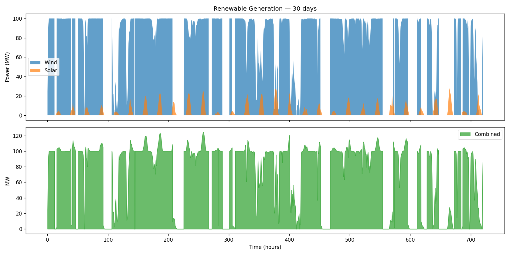
  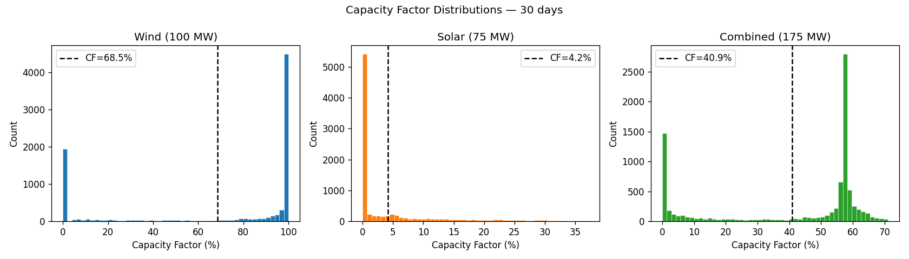
</p>
<p align="center">
  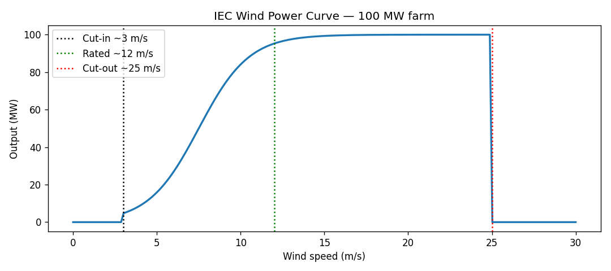
  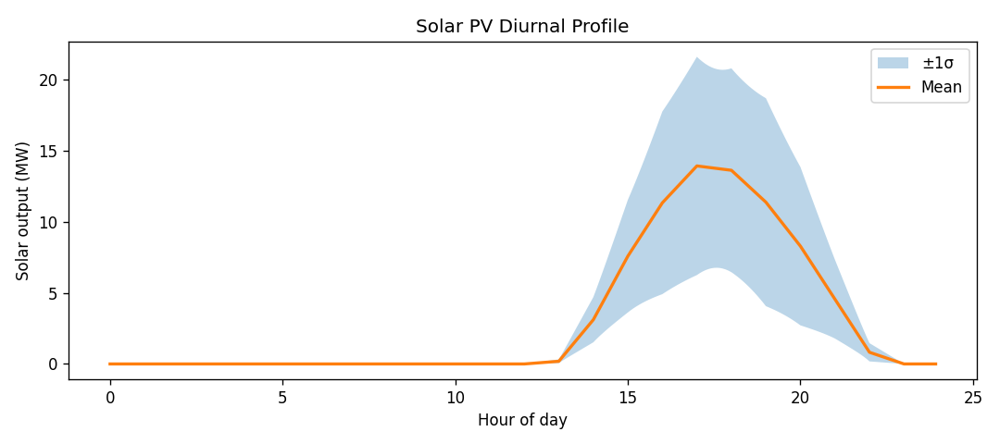
</p>

**Wind + solar generation time-series** (100 MW wind + 75 MW solar PV); **capacity factor distributions** by season; **IEC wind power curve** (cut-in 3 m/s, rated 12 m/s, cut-out 25 m/s); **solar diurnal profiles** across markets and seasons.

---

### Environment API & Rollouts (`06_environments.ipynb`)

<p align="center">
  
  
</p>
<p align="center">
  
  
</p>
<p align="center">
  
  
</p>

**C2GFastEnv 24-hour rollout** (temperature, SOC, power, reward traces); **reward component breakdown** (tracking error, thermal penalty, SOC penalty, freq/voltage penalties); **step-reward distribution**; **observation space coverage** showing all 16 dimensions are exercised; **C2GMacroEnv rollout** at 15-min resolution; **cross-scenario reward comparison**.

---

### Weather Data (`07_weather.ipynb`)

<p align="center">
  
  
</p>
<p align="center">
  
  
</p>
<p align="center">
  
  
</p>
<p align="center">
  
</p>

**Annual temperature profiles** for all 6 markets (NYC, DCA, SJC, DFW, FRA, BKT); **annual distribution**; **diurnal patterns** by season; **synthetic vs. real NOAA ISD validation**; **implied COP** showing how weather drives cooling cost; **normalised histograms**; **southern hemisphere seasonal inversion** (AEMO NSW summer = January).

---

### Energy Markets (`08_energy_markets.ipynb`)

<p align="center">
  
  
</p>
<p align="center">
  
  
</p>
<p align="center">
  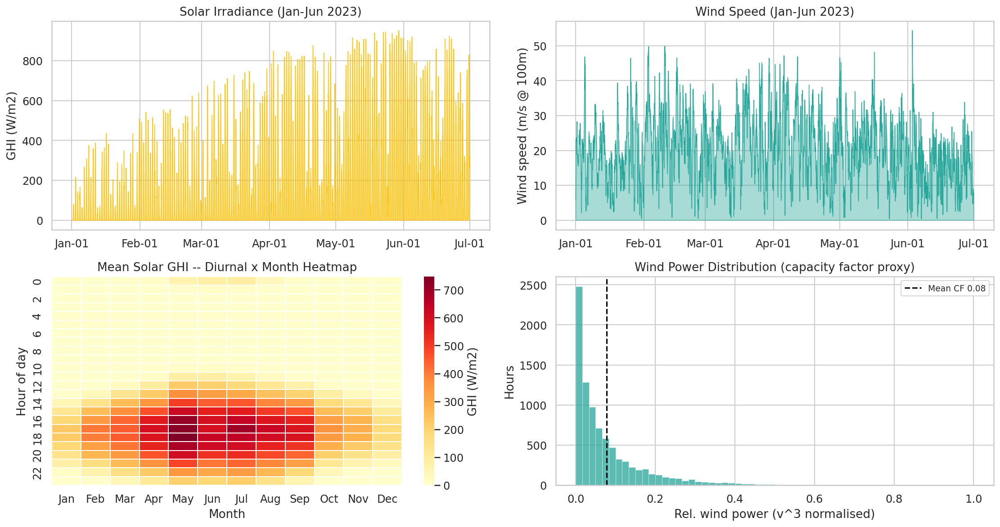
  
</p>

**Annual grid load** (NYISO 11-zone, PJM DOM, CAISO PG&E, ERCOT North, ENTSO-E DE, AEMO NSW); **diurnal patterns**; **load duration curves + LMP distribution**; **grid stress indicator calibration** used by `macro_grid.py`; **renewable penetration** vs. load; **joint weather–energy distribution** (ambient temperature vs. LMP — key for thermal-economic co-optimisation).

---

### Evaluation Scenarios (`10_evaluation_scenarios.ipynb`)

<p align="center">
  
  
</p>
<p align="center">
  
</p>
<p align="center">
  
  
</p>
<p align="center">
  
</p>

**Parameter overview** (6 bar charts: T_amb, committed MW, BESS SOC₀, GenAI scale, grid stress, cooling efficiency); **radar chart** showing the overall stress fingerprint of each scenario; **2-hour rollout traces** across all 4 scenarios for 5 physical signals; **termination risk** under 30 random-policy episodes; **cumulative reward gap** between scenarios; **24-configuration grid** of all Scenario × Market pairings.

<p align="center">
  
</p>

**Zone temperature comparison** across all 4 scenarios showing the thermal headroom difference driven by T_amb and committed MW settings.
